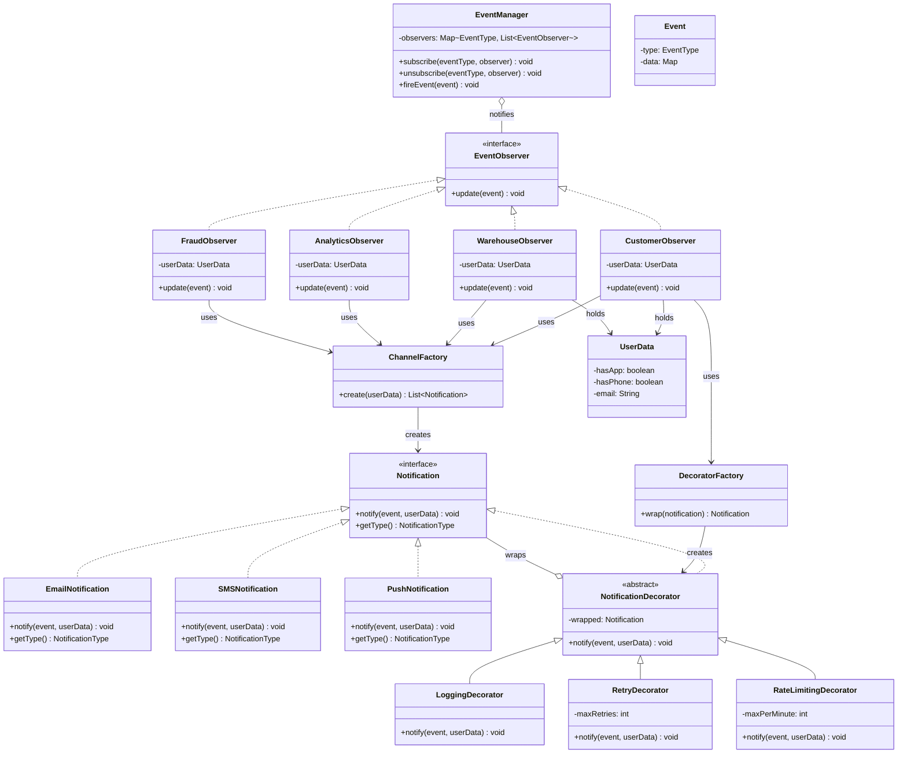
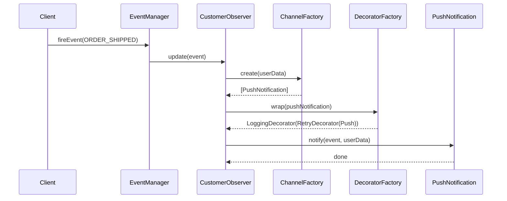

# Smart Notification System — Design Document

## Problem Statement

An e-commerce platform needs a notification system that:
1. Notifies multiple parties (Customer, Warehouse, Analytics, Fraud) when events occur (Order Placed/Shipped/Delivered, Payment Failed)
2. Supports multiple channels: Email, SMS, Push Notification
3. Allows optional features (Logging, Rate Limiting, Retry) to be combined freely on any channel
4. Selects channels at runtime based on user profile data

---

## Design Patterns Used

| Pattern | Where | Why |
|-----------|-------|-----|
| **Observer** | EventManager → Observers | Multiple parties react to a single event without tight coupling |
| **Strategy** | SMS / Email / Push as interchangeable `Notification` implementations | Channel logic varies but the interface is uniform |
| **Factory** | `ChannelFactory`, `DecoratorFactory` | Channel selection and decorator wrapping depend on runtime data |
| **Decorator** | Logging, Retry, RateLimiting wrapping a `Notification` | Optional behaviors layered freely without subclass explosion |

---

## Key Interfaces & Classes

### 1. Notification (Strategy Interface)

```
<<interface>> Notification
  + notify(event: Event, userData: UserData): void
  + getType(): NotificationType
```

Concrete strategies: `EmailNotification`, `SMSNotification`, `PushNotification`

### 2. NotificationDecorator (Decorator Base)

```
<<abstract>> NotificationDecorator implements Notification
  - wrapped: Notification
  + notify(event: Event, userData: UserData): void
```

Concrete decorators: `LoggingDecorator`, `RetryDecorator`, `RateLimitingDecorator`

### 3. Observer Pattern

```
<<interface>> EventObserver
  + update(event: Event): void

EventManager (Subject)
  - observers: Map<EventType, List<EventObserver>>
  + subscribe(eventType: EventType, observer: EventObserver): void
  + unsubscribe(eventType: EventType, observer: EventObserver): void
  + fireEvent(event: Event): void
```

Concrete observers: `CustomerObserver`, `WarehouseObserver`, `AnalyticsObserver`, `FraudObserver`

Each observer holds a `UserData` reference and delegates channel selection to the factory.

### 4. Factories

```
ChannelFactory
  + create(userData: UserData): List<Notification>
    // has app → Push, has phone → SMS, default → Email

DecoratorFactory
  + wrap(notification: Notification): Notification
    // based on notification.getType(), layers appropriate decorators
```

---

## Event Flow (Trace)

```
1. ORDER_SHIPPED event occurs

2. EventManager.fireEvent(ORDER_SHIPPED)
   └── iterates observers registered for ORDER_SHIPPED

3. CustomerObserver.update(event):
   ├── channels = ChannelFactory.create(this.userData)   → [Push, Email]
   ├── decorated = DecoratorFactory.wrap(each channel)   → [Push+Log+Retry, Email+Log]
   └── for each: decorated.notify(event, userData)

4. WarehouseObserver.update(event):
   ├── channels = ChannelFactory.create(this.userData)   → [Email]
   ├── decorated = DecoratorFactory.wrap(each channel)   → [Email+Log]
   └── for each: decorated.notify(event, userData)
```

---

## UML Class Diagram



---

## Sequence Diagram



---

## Design Decisions Summary

1. **Observer** decouples event sources from listeners — adding a new listener (e.g., Loyalty Module) requires zero changes to existing code.
2. **Strategy** makes channels interchangeable — all implement `Notification`, so the rest of the system doesn't care if it's SMS or Push.
3. **Factory** encapsulates creation logic — channel selection (based on UserData) and decorator assembly (based on NotificationType) each live in one place.
4. **Decorator** avoids subclass explosion — instead of `LoggingSMSNotification`, `RetryPushNotification`, etc., features are layered dynamically.
5. **Observers delegate to factories** instead of owning channel preferences — ensures channel selection uses current profile data at runtime.
